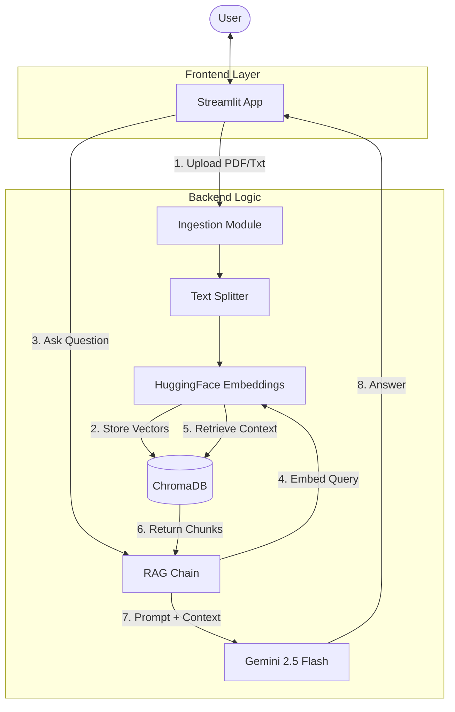

# AI Knowledge Base Agent

## 🤖 What is this?
This project is an **AI-powered Knowledge Base Agent**. It acts as an intelligent assistant that can read, understand, and answer questions based on your own documents (PDFs, Text files).

Unlike standard AI (like ChatGPT) which only knows what it was trained on, this agent knows **your specific data**.

## 🧠 How does it work? (The "Agent" Workflow)
This system uses a technique called **RAG (Retrieval-Augmented Generation)**. Here is the step-by-step process:

1.  **Ingestion (The "Reading" Phase)**:
    *   You upload a document (e.g., "Company_Policy.pdf").
    *   The system reads the text and breaks it down into small, manageable chunks.

2.  **Memory (Vector Store)**:
    *   It converts these text chunks into numerical lists called "embeddings" using a local **HuggingFace** model.
    *   These embeddings are stored in a **Vector Database** (`ChromaDB`). This acts as the agent's long-term memory.

3.  **Retrieval (The "Thinking" Phase)**:
    *   When you ask a question (e.g., "What is the sick leave policy?"), the system converts your question into numbers.
    *   It searches its memory (`ChromaDB`) for the text chunks that are most similar to your question.

4.  **Generation (The "Speaking" Phase)**:
    *   It sends your question + the relevant text chunks found to **Google Gemini** (the LLM).
    *   Gemini generates a natural language answer based *only* on the facts found in your documents.

## Who is this for?
*   **Companies**: For HR policies, technical manuals, onboarding docs.
*   **Legal Teams**: To quickly find clauses in contracts.
*   **Students/Researchers**: To query long academic papers.
*   **Anyone**: Who needs to chat with their documents.

## Does it only work for company documents?
**No!** While "Company Documents" is a primary use case, it works with **any text-based document**. You can upload:
*   A favorite book.
*   Research papers.
*   Meeting notes.
*   Personal journals.

## Tech Stack
*   **Brain**: Google Gemini 2.5 Flash
*   **Memory**: ChromaDB
*   **Embeddings**: HuggingFace (Local)
*   **Framework**: LangChain
*   **Interface**: Streamlit

## 🏗️ Architecture Diagram

